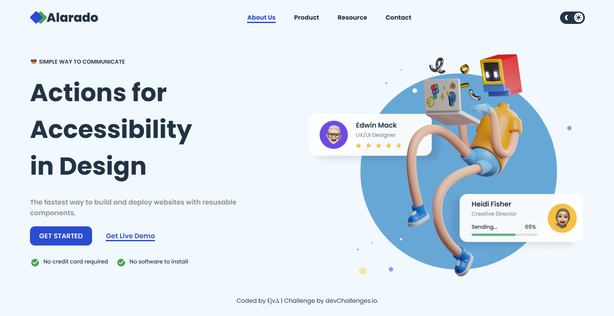

<!-- Please update value in the {}  -->

<h1 align="center">{Simple Homepage - Alarado} | devChallenges</h1>

   Solution for a challenge <a href="https://devchallenges.io/challenge/simple-hompage-alarado" target="_blank">Simple Homepage - Alarado </a> from <a href="http://devchallenges.io" target="_blank">devChallenges.io</a>.

  <h3>
    <a href="https://your-demo-link.your-domain](https://codebyev.github.io/alarado/">
      Demo
    </a>
     | 
    <a href="https://devchallenges.io/challenge/simple-hompage-alarado">
      Challenge
    </a>
  </h3>

<!-- TABLE OF CONTENTS -->

## Table of Contents

- [Overview](#overview)
  - [What I learned](#what-i-learned)
  - [Useful resources](#useful-resources)
- [Built with](#built-with)
- [Features](#features)
- [Contact](#contact)

<!-- OVERVIEW -->

## Overview

Challenge from devchallenges.io to create simple homepage that matches given design using HTML, CSS and JS. Even thou its a simple design, for me - as beginer - it was really challenge and it helped me understand more about responsive design and practice coding.

### What I learned

Thanks to this challenge I learn how to create toggle switch to change theme from light to dark. Struggled with this a lot but in the end I manage to do that and add it also to sidebar. 

### Useful resources

https://www.coding2go.com/ - helped me to uderstand more how to make sidebar and also switch button for dark mode

### Built with

- Semantic HTML5 markup
- CSS custom properties
- Flexbox

## Features

This application/site was created as a submission to a [DevChallenges](https://devchallenges.io/challenges-dashboard) challenge.

## Author

- GitHub [@CodeByEv](https://github.com/CodeByEv)
